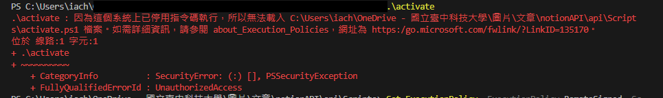

今天在 VS code 開啟 python 虛擬環境的時候執行 active 卻顯示



## 讓我執行這個指令！！

VSC 終端機看起來權限不太夠，這時候我們可以暫時更改執行政策以允許執行虛擬環境的 Script。請按照以下步驟進行：

### 更改 PowerShell 執行政策

1. **以管理員身份執行 PowerShell**：
    - 在 Windows 開始中，搜尋「PowerShell」。
    - 右鍵點擊「Windows PowerShell」並選擇「以管理員身份執行」。
2. **檢查當前的執行政策**（可選）：
    
    ```
    Get-ExecutionPolicy
    ```
    

**3.更改執行政策**：

- 如果你只是臨時想讓終端機執行虛擬環境，可以使用以下命令來允許執行當前會話中的指令：

```powershell
Set-ExecutionPolicy -ExecutionPolicy Bypass -Scope Process
```

如果你希望永久更改執行政策，可以使用以下命令（注意，這樣會更改系統設定，請謹慎操作）：

```powershell
Set-ExecutionPolicy -ExecutionPolicy RemoteSigned -Scope CurrentUser

```

**5.（可選）將執行政策恢復為預設設定**：
如果你選擇了臨時更改執行政策，則在關閉 PowerShell 後，政策將自動恢復。如果永久更改了執行政策，你可以使用以下命令恢復為默認設定：

```powershell
Set-ExecutionPolicy -ExecutionPolicy Restricted -Scope CurrentUser
```